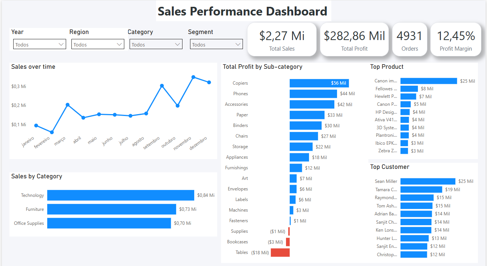

# Análise de Vendas com SQL e Power BI

Este projeto realiza uma análise exploratória de vendas utilizando o dataset **Superstore**, com o objetivo de identificar padrões de vendas, lucratividade de produtos e comportamento de clientes.

A análise foi realizada utilizando **SQL para exploração e agregação dos dados** e **Power BI para construção de um dashboard interativo**.

O projeto demonstra um fluxo completo de análise de dados:

- Exploração de dados com SQL
- Limpeza e transformação de dados
- Análise de métricas de negócio
- Construção de dashboard analítico

---

# Ferramentas Utilizadas

- **MySQL** – exploração e análise dos dados
- **SQL** – consultas e agregações
- **Power BI** – visualização e criação de dashboard
- **GitHub** – versionamento e portfólio de projetos

---

# Dataset

Foi utilizado o **Superstore Dataset**, um conjunto de dados de vendas de varejo contendo informações sobre:

- Pedidos
- Produtos
- Clientes
- Vendas
- Lucro
- Descontos
- Informações de envio

Os dados analisados abrangem o período de **2014 a 2017**.

---

# Estrutura do Projeto
sales-analysis-powerbi-sql
│
├── data
│ └── superstore.csv
│
├── sql
│ └── analysis_queries.sql
│
├── dashboard
│ └── superstore_dashboard.pbix
│
├── images
│ └── dashboard.png
│
└── README.md

---

# Análises Realizadas

Durante o projeto foram realizadas diversas análises utilizando SQL e Power BI.

## Métricas principais

- Total de vendas
- Total de lucro
- Margem de lucro
- Total de pedidos

## Análise temporal

- Evolução das vendas ao longo do tempo
- Análise de vendas por mês

## Análise de produtos

- Vendas por categoria
- Lucro por subcategoria
- Produtos mais lucrativos

## Análise de clientes

- Clientes com maior volume de vendas
- Contribuição dos principais clientes para a receita

---

# Dashboard

O dashboard desenvolvido no Power BI permite visualizar de forma interativa os principais indicadores de vendas.

Ele inclui:

- KPIs de vendas e lucratividade
- Evolução das vendas ao longo do tempo
- Análise de lucro por subcategoria
- Ranking de produtos
- Ranking de clientes
- Filtros interativos por ano, região, categoria e segmento

---

# Principais Insights

A análise permitiu identificar alguns pontos importantes:

- A categoria **Technology** apresenta o maior volume de vendas.
- Algumas subcategorias como **Tables e Bookcases apresentam prejuízo**.
- A subcategoria **Copiers apresenta a maior lucratividade**.
- Uma pequena parcela de clientes representa uma parte significativa das vendas totais.

Essas informações podem auxiliar na tomada de decisão sobre estratégia de produtos e otimização da lucratividade.

---

# Autor

**Pedro Possidio**

Profissional em transição de carreira do mercado financeiro para a área de **Análise de Dados**, com foco em desenvolvimento de habilidades em:

- SQL
- Python
- Power BI
- Análise de Dados
- Visualização de Dados

GitHub:  
https://github.com/ppossidio

LinkedIn:  
https://www.linkedin.com/in/pedro-possidio/

---
